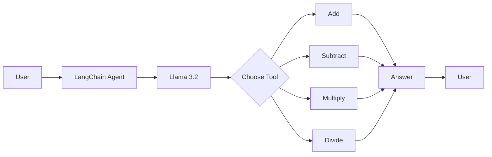
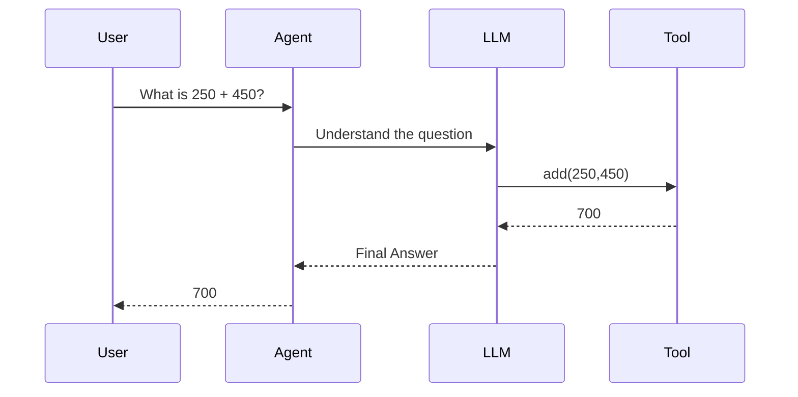

# 🤖 AI Calculator Agent using LangChain + Ollama


An intelligent calculator built using **LangChain Agents**, **Tools**, and **Ollama (Llama 3.2)**.

Instead of performing calculations directly in Python, the **AI Agent** understands natural language, selects the appropriate mathematical tool, executes it, and returns the answer.

---

# 🚀 Features

- ➕ Addition
- ➖ Subtraction
- ✖ Multiplication
- ➗ Division
- 🤖 AI Agent powered by LangChain
- 🧠 Natural Language Understanding
- 🛠 Custom Tools using `@tool`
- 💬 Interactive CLI Calculator
- ⚡ Runs completely locally using Ollama

---

# 📂 Project Structure

```
AI-Calculator-Agent/
│
├── calculator.py
├── README.md
└── requirements.txt
```

---

# 🏗 Project Architecture



---

# 🧠 How It Works

The AI Agent follows these steps:

1. Receives the user's question.
2. Understands the intent.
3. Decides which mathematical tool is required.
4. Executes the tool.
5. Returns the final answer.

---

## Example Workflow



---

# 🛠 Custom Tools

The project uses LangChain's **Tool Decorator**.

Example

```python
@tool
def add(a:int,b:int):
    """Add two numbers."""
    return a+b
```

LangChain automatically converts the Python function into a Tool object.

```
Python Function
        │
        ▼
   @tool Decorator
        │
        ▼
     Tool Object
        │
        ├── Name
        ├── Description
        ├── Arguments
        └── invoke()
```

---

# 🏗 Agent Creation

```python
agent = create_agent(
    model=llm,
    tools=[add, subtract, multiply, divide],
    system_prompt="""
    You are an AI calculator.
    Always use the provided tools.
    """
)
```

The Agent knows

- Which LLM to use
- Which Tools are available
- When to call a Tool

---

# ⚙ Working Flow

```mermaid
flowchart TD

A[User Question]

↓

B[Agent]

↓

C[LLM Thinking]

↓

D{Need Tool?}

D--Yes-->E[Call Tool]

D--No-->F[Generate Answer]

E-->G[Tool Result]

G-->H[LLM Response]

F-->H

H-->I[Final Answer]
```

---

# 💻 Example Usage

```
========================================
      AI Calculator Agent
========================================

Enter Calculation:
```

Example 1

```
Input

25 + 15

Output

40
```

---

Example 2

```
Input

Multiply 20 by 5

Output

100
```

---

Example 3

```
Input

Divide 200 by 4

Output

50
```

---

Example 4

```
Input

Subtract 150 from 400

Output

250
```

---

# 🔥 Agent vs Python Calculator

## Traditional Python

```python
print(10+20)
```

Python already knows the operation.

---

## AI Agent

```
"What is ten plus twenty?"

↓

LLM understands language

↓

Chooses Add Tool

↓

Returns Answer
```

The AI Agent understands **natural language**, not just operators.

---

# 🧩 invoke() Flow

```mermaid
flowchart LR

User

-->

Agent.invoke()

-->

Agent

-->

LLM

-->

Tool

-->

Final Response
```

---

# 📦 Technologies Used

- Python
- LangChain
- Ollama
- Llama 3.2
- LangChain Tools
- LangChain Agents

---

# 📚 Concepts Covered

- AI Agents
- LangChain
- Ollama
- Tool Calling
- `@tool`
- `create_agent()`
- `invoke()`
- Natural Language Processing
- Function Calling
- AI Automation

---

# 🛠 Installation

Clone the repository

```bash
git clone https://github.com/your-username/AI-Calculator-Agent.git
```

Move into the project

```bash
cd AI-Calculator-Agent
```

Install dependencies

```bash
pip install -r requirements.txt
```

Pull the Ollama model

```bash
ollama pull llama3.2
```

Run the application

```bash
python calculator.py
```

---

# 🎯 Learning Outcomes

After completing this project, you will understand:

- How LangChain Tools work
- How the `@tool` decorator converts Python functions into tools
- How Agents decide which tool to call
- How LLMs perform tool calling
- Difference between an LLM and an Agent
- How `invoke()` executes an Agent
- Building AI-powered CLI applications

---

# 📸 Output

```
========================================
      🤖 AI Calculator Agent
========================================

Enter Calculation:
What is 100 + 250?

Answer:
350
```

---

# ⭐ Future Improvements

- Percentage Calculator
- Power (`x^y`)
- Square Root
- Modulus
- Scientific Calculator
- Memory Functions
- Voice Input
- Streamlit Web Application
- Chat History
- Multi-Step Calculations

---

# 🎉 Conclusion

This project demonstrates how **LangChain Agents** combine the reasoning abilities of an LLM with external **Tools** to solve mathematical problems.

Unlike a traditional calculator, the AI Agent understands **natural language**, chooses the appropriate tool, performs the calculation, and responds intelligently, making it a great beginner project for learning **AI Agents, Tool Calling, and LangChain**.