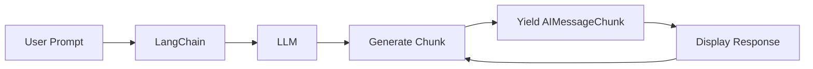
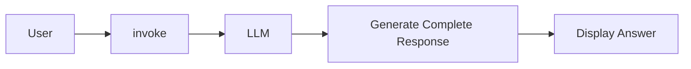
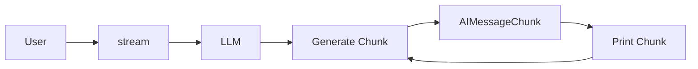
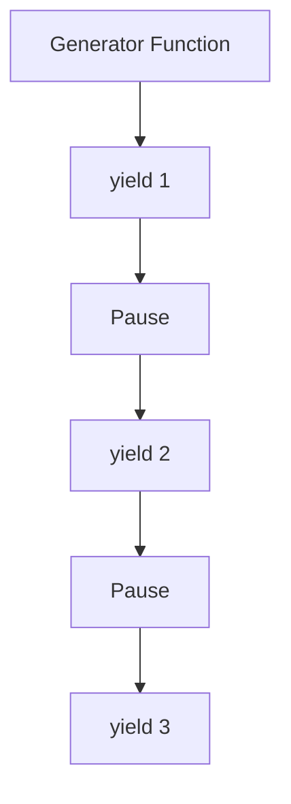
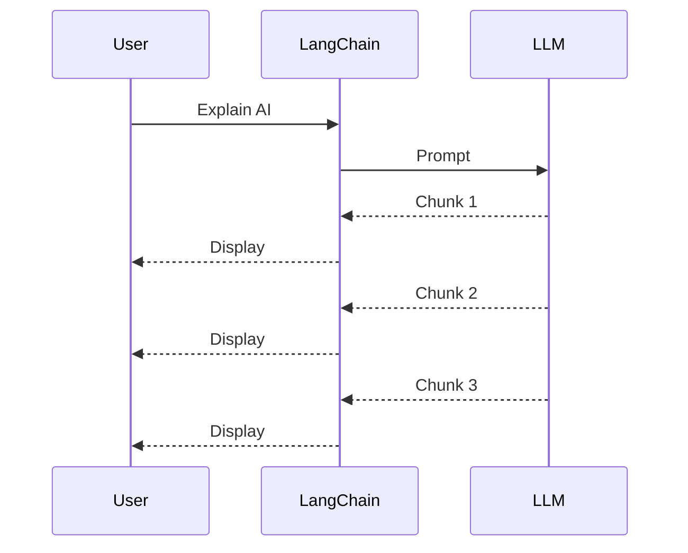
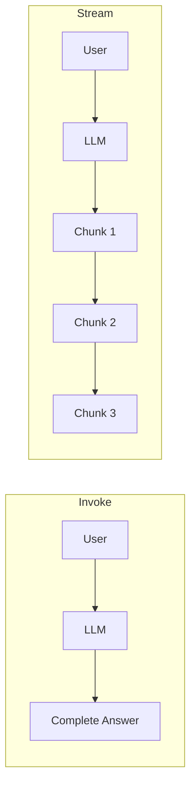

# 🌊 LangChain Streaming (`.stream()`) & Python Generators


---

# 📖 Project Overview

This project explains how **LangChain's `.stream()`** works and why it is based on the concept of **Python Generators**.

Instead of waiting for the complete response, the LLM streams the answer **chunk by chunk**, creating a real-time typing experience similar to ChatGPT.

---

# 🏗 Overall Workflow



---

# 🖼 Without Streaming



Example

```python
response = llm.invoke("Explain AI")

print(response.content)
```

The user waits until the complete answer is generated.

---

# 🖼 With Streaming



Example

```python
for chunk in llm.stream("Explain AI"):
    print(chunk.content, end="")
```

Output

```
Artificial Intelligence is the simulation of human intelligence...
```

The answer appears while the model is still generating.

---

# 🧠 Python Generator

A generator produces values **one at a time**.

```python
def numbers():

    yield 1
    yield 2
    yield 3
```

---

## Generator Workflow



---

# Relationship Between Generator and Stream

Think of `stream()` as a generator.

Normal Generator

```python
def stream():

    yield "Artificial "

    yield "Intelligence "

    yield "is "

    yield "Amazing!"
```

LangChain internally behaves similarly.

---

## Comparison

| Generator | LangChain Stream |
|------------|------------------|
| yield 1 | yield AIMessageChunk |
| yield 2 | yield AIMessageChunk |
| yield 3 | yield AIMessageChunk |

---

# What Actually Happens?



---

# `.invoke()` vs `.stream()`

| Feature | `.invoke()` | `.stream()` |
|----------|-------------|-------------|
| Returns | AIMessage | AIMessageChunk |
| Response | Complete | Incremental |
| Uses Generator | ❌ No | ✅ Yes |
| Best For | APIs | Chatbots |
| Real Time | ❌ | ✅ |

---

# Return Types

## invoke()

```python
response = llm.invoke("Hello")

print(type(response))
```

```
AIMessage
```

Access

```python
response.content
```

---

## stream()

```python
for chunk in llm.stream("Hello"):

    print(type(chunk))
```

```
AIMessageChunk
```

Access

```python
chunk.content
```

---

# Visual Comparison



---

# Why Streaming?

Without Streaming

```
⏳ Wait...
⏳ Wait...
⏳ Wait...
Complete Response
```

With Streaming

```
Artificial
Artificial Intelligence
Artificial Intelligence is
Artificial Intelligence is amazing...
```

---

# Real World Applications

- 🤖 ChatGPT
- 💬 AI Chatbots
- 📄 PDF Chatbots
- 📚 RAG Applications
- 🧠 AI Agents
- 👨‍💻 Coding Assistants
- 🎤 Voice Assistants

---

# Key Concepts Learned

- Python Generator
- yield
- next()
- Generator Object
- AIMessage
- AIMessageChunk
- invoke()
- stream()
- Real-Time Streaming
- LangChain

---

# Final Architecture

```mermaid
flowchart TB

User

↓

LangChain

↓

LLM

↓

Generator

↓

AIMessageChunk

↓

Display Response
```

---

# ⭐ Conclusion

`.stream()` is built on the same concept as **Python Generators**.

Instead of returning the entire response at once, it **yields AIMessageChunk objects one by one**, enabling real-time streaming just like ChatGPT.