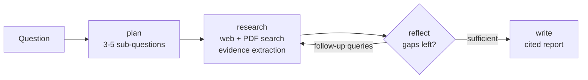

# 🔬 DeepScope — a self-critiquing deep-research agent

DeepScope takes one question and does what a good analyst does: it **plans**
sub-questions, **searches** the web and your own PDFs, **criticises its own
findings** to spot gaps, searches again, and finally **writes a cited markdown
report**. The whole reasoning trace is streamed live in the UI, so a judge can
watch the agent think.

Built on **LangGraph + LangChain + Groq + Streamlit**.

## Why it demos well

- **Visible reasoning** — every node (planner → researcher → critic → writer) streams its log line into the UI. No black-box spinner.
- **Self-correction loop** — the critic node re-queues follow-up queries, so a second research round happens on stage.
- **Grounded, cited answers** — every bullet carries `[S#]` ids that resolve to a real URL or a page of an uploaded PDF.
- **Runs with one free key** — Groq only. Web search falls back to keyless DuckDuckGo when no Tavily key is present.
- **No heavyweight setup** — document grounding uses an in-process BM25 index, so PDF upload is instant (no embedding download, no vector DB to run).

## Architecture



State is a single `ResearchState` TypedDict carrying the plan, the queue of open
sub-questions, deduplicated sources, per-question findings and the log.

| File | Role |
| --- | --- |
| `graph.py` | The LangGraph state machine and node prompts |
| `search.py` | Tavily / DuckDuckGo web search with graceful degradation |
| `retrieval.py` | PDF chunking + BM25 retrieval over uploaded documents |
| `llm.py` | Groq chat model plus tolerant JSON-list parsing |
| `app.py` | Streamlit UI with the live agent trace |
| `cli.py` | Same agent from the terminal |

## Quickstart

```bash
pip install -r deepscope/requirements.txt
export GROQ_API_KEY=...            # free at https://console.groq.com
export TAVILY_API_KEY=...          # optional, better search quality
export DEEPSCOPE_MODEL=...         # optional, defaults to openai/gpt-oss-120b on Groq

streamlit run deepscope/app.py
# or
python -m deepscope.cli "Compare LangGraph and CrewAI for multi-agent systems"
```

The Groq key can also be pasted into the sidebar at runtime, which is handy on a
shared demo machine.

## 90-second demo script

1. Open the app, paste the Groq key, show `Search: duckduckgo` (no paid keys needed).
2. Click the example question **"Compare LangGraph and CrewAI for building multi-agent systems"** and hit **Run research**.
3. Narrate the trace as it streams: the planner's sub-questions, each search with its new-source count, then the critic's gap list triggering round 2.
4. Show the final report — point at an `[S#]` citation and match it to the Sources list.
5. Upload a PDF (e.g. a resume or a paper), ask a question about it, and show the same report now citing `filename p.3` alongside web sources.
6. Download the markdown report — the trace and report stay on screen.

Tip: with keyless DuckDuckGo, questions about a person's name pull in namesakes.
For document demos, ask about the content ("which RAG projects are described?")
rather than the name.

## Tests

```bash
python -m pytest deepscope/tests -q     # offline, no API keys required
```
